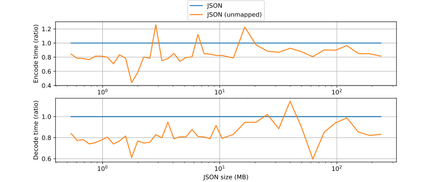
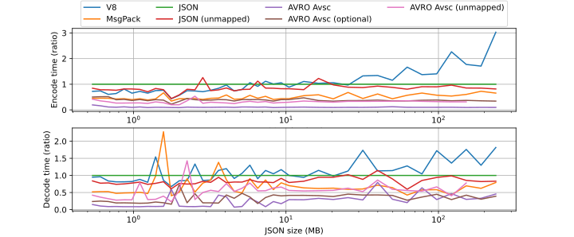
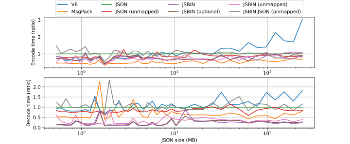
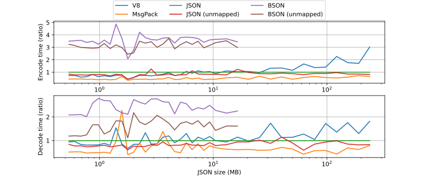

# Binary serialization comparison in JavaScript
 
This is a comparison and benchmark of various binary serialization formats used in JavaScript as of 2020-07-28.
 
I was myself trying to decide what binary serialization format I should use with regard to performance, compression size and ease of use in my personal projects, and before I knew it I had spent the last few days doing a rather extensive comparison.
 
By sharing my findings, I hope it can be of help (and save time) to someone in a similar situation and perhaps inspire some developers to try out binary serialization.
 
For those in a hurry, feel free to skip to the Abstract and Conclusion sections.

## Table of content

- [Abstract](#abstract)
- [Introduction](#introduction)
- [Setup](#setup)
- [Disclaimer](#disclaimer)
- [Libraries](#libraries)
- [Benchmark](#benchmark)
- [Result (Protocol Buffers)](#result-protocol-buffers)
- [Result (final)](#result-final)
- [Result (extra)](#result-extra)
- [Conclusion](#conclusion)
 
## Abstract
 
The following JavaScript serialization libraries and versions are compared with regards to performance, compression size and ease of use:
 
* `protobufjs "6.10.1"` 
* `bson "4.0.4"` 
* `pbf "3.2.1"`
* `google-protobuf "4.0.0-rc.1"`
* `avsc "5.4.21"` 
* `protons "1.2.1"` 
* `js-binary "1.2.0"` 
 
During encoding, `avsc` performed the fastest at 10 times faster than native JSON at most payload sizes, followed by `js-binary`, `protons` at 2 times faster. `protobufjs` and `bson` performed the slowest at about 3 times slower than native JSON.
 
During decoding, `avsc`, `protobufjs`, `js-binary` all performed similarly well at about 5 times faster than native JSON at most payload sizes, though `avsc` seems to have a slight advantage. `protons` performed the slowest at 20-30 times slower, followed by `bson` at 1.5 times slower
 
`avsc` and `js-binary` gave the best compression ratio of the encoded data at 0.32 compared to JSON, followed by `protobufjs`, `pbf`, `google-protobuf`, `protons` with a ratio of 0.42.
 
`avsc` and `js-binary` was able to handle the largest file sizes at both encoding and decoding, with an estimate of 372 MB (measured as JSON) given the default Node.js-heap size. In general, the maximum file size coincided with the measured encoding/decoding-speed of each implementation.
 
`js-binary`, `pbf`, `bson` all convert cleanly back to JavaScript without any detected remnants from the encoding process. `avro-js` and `js-binary` contained minor remnants. `google-protobuf` and `protons` had major remnants or ramifications.
 
## Introduction
 
Data serialization is ubiquitous in most areas such as sending and receiving data over the network or storing/reading data from the file system. While JSON is a common modus operandi (especially in JavaScript), using a binary serialization format typically provides and advantage in compression size and performance at the cost of losing human readability of the encoded data.
 
Two common binary serialization formats across many programming languages are Protocol Buffers and Apache Avro. Avro is inherently a bit more compact than Protobuf, whereas Protobuf uses the additional data as field tags that could make it slightly more forgiving when changing the schema. For those interested, an excellent in-depth explanation has already been written by Martin Kleppmann: https://martin.kleppmann.com/2012/12/05/schema-evolution-in-avro-protocol-buffers-thrift.html
 
In addition to this, several more recent JavaScript oriented libraries will be included in the comparison.
 
This article will mostly focus on the performance aspect and provide a brief overview of each implementation, but as always, there will be pros and cons of each implementation that could be overlooked depending on your use-case.
 
## Setup
 
To run the benchmark yourself, follow these steps.
 
* Install Node.js ( `12.18.3 LTS` is recommended). 
* Install dependencies:
 
```shell script
npm install
``` 
* Use the default configuration or modify `src/config.ts` as you see fit.
* Select what libraries to test by changing `run-tests.sh` or use default that tests all libraries.
* Run `run-tests.sh` (if you are on Windows use Git BASH or similar):  
 
```shell script
cd src
. run-tests.sh
```
 
* Create graph images (requires Python with matplotlib installed) by running:
 
```shell script
python plot.py
``` 
 
Graph settings can further be configured inside the script. Graph images are by default written to `img/`
 
Measurements are accumulated into `src/tmp/plot.json` each benchmark iteration. If needed, simply delete the file to reset the graph.
 
## Disclaimer
 
This article only focuses on measurements using JavaScript. Many of the measured formats support additional programming languages that could have different performance characteristics than indicated in this benchmark.
 
Although outside the scope of this article, compression size (and there by network transfer speed) can be further improved at the cost of encoding/decoding performance by combining the output with a compressor/decompressor library such `google/snappy` or `zlib`.
 
This is the first time I use many of the listed libraries and as such there might still be additional optimizations that I am unaware of. Still, I believe my implementation is a good indication to what most users will end up using.
 
Feel free to inspect my implementations in `src/benchmarks.ts`, and let me know if you find any glaring mistakes (or better yet by submitting a pull request).
 
 
## Libraries
 
The following libraries and versions are tested (sorted by weekly downloads):
 
* `protobufjs "6.10.1"` - 3,449k downloads
* `bson "4.0.4"` - 1,826k downloads
* `pbf "3.2.1"` - 431k downloads
* `google-protobuf "4.0.0-rc.1"` - 348k downloads
* `avsc "5.4.21"` - 43k downloads
* `protons "1.2.1"` - 30k downloads
* ~~`avro-js "1.10.0"` - 1.2k downloads~~
* `js-binary "1.2.0"` - 0.3k downloads
 
They are categorized as:
 
* Protocol Buffer ( `protobufjs` , `pbf`, `google-protobuf` , `protons` ): `google-protobuf` is Googles official release, but `protobufjs` is by far the most popular, possible due to it being easier to use. To further compare against `protobufjs` a third library called `protons` is included.  
* BSON ( `bson` ): BSON stands for Binary JSON and is popularized by its use in MongoDB. 
* Avro ( `avsc`, `avro-js` ): `avsc` seems to be the most popular Avro library. `avro-js` appears to be an offical release by the Apache Foundation but this was excluded from the result section as it seems to be based on a older version on `avsc`, and both libraries yielded very similar benchmark results with a slight advantage to `avsc`.
* JS-Binary ( `js-binary` ): The most obscure (judging by weekly downloads). Still `js-binary` seemed like a good contender due to it being easy to use (having a very compact and flexible schema-format) and being optimized for JavaScript. The main drawback being that it will be difficult to use in other programming languages should the need arise.
 
## Benchmark
 
Each format will be compared against JavaScripts built in JSON library as a baseline, regarding compression size and encoding/decoding time. 
 
The data used in the benchmark is a growing array of tuples that is grown in increments of 1/8 below 10 MB, at each iteration and to speed things up 1/4 above 10 MB. In a real scenario it could be thought of as a list of vectors in a 2D or 3D space, such as a 3D-model or similarly data intensive object. 
 
To further complicate things the first element of the tuple is an integer. This will give a slight edge to some serialization-formats as an integer can be represented more compact in binary rather than floating-point number. 
 
To all formats that support multiple datatype sizes; integers are encoded as a 32-bit signed integer and decimal numbers are encoded as 64-bit floating-point numbers.
 
The data is as follows:
 
```typescript
[
  [1, 4.0040000000000004, 1.0009999999999994], 
  [2, 4.371033333333333, 0.36703333333333266], 
  [3, 5.171833333333334, 0.4337666666666671], 
  [4, 6.473133333333333, 0.36703333333333354], 
  ...
]
``` 
 
The first challenge that arose is that not all serialization formats supports root level arrays, and almost no one seems to support tuples, and as such the arrays first need to be mapped to structs as follows:
 
```typescript
{
  items: [
    {x: 1, y: 4.0040000000000004, z: 1.0009999999999994},
    {x: 2, y: 4.371033333333333, z: 0.36703333333333266},
    {x: 3, y: 5.171833333333334, z: 0.4337666666666671},
    {x: 4, y: 6.473133333333333, z: 0.36703333333333354},
    ...
  ]
}
``` 
 
This wrapped struct array is the final payload that is used in the benchmark unless specified otherwise.
 
This further gives an advantage to some formats over JSON as duplicate information such as field names can be encoded more efficiently in a schema.
 
### Precautions
 
Each appended element in the growing array is modified slightly so that all elements are unique. This is to prevent unpredictable object reuse that could impact measurements.
 
It was also discovered that some libraries can considerably impact the performance of other libraries when measured in the same running process. To prevent this (and to get reproducible results) all measurements in the results section has been measured with each implementation running in an isolated Node.js process.
 
To reduce unpredictable stalls by the automatic garbage collector in Node.js, the garbage collector is forcefully triggered before each measurement. This does not seem to have any discernable impact on the measured performance other than reducing some randomness.
 
### Unmapped data
 
It should be noted that the time to convert the unmapped data to the mapped structs is excluded from all measurements in the benchmark. Although unmeasured in this article, mapping the data would probably neglect many performance benefit of the selected format and as such, if your application internally uses a similar data representation to the unmapped data you probably want to pick a serialization format that supports its unmapped form.
 
However, the unmapped formatted is more compact (at the cost of readability) and contains less redundant information that could improve serialization performance. To those interested there exists an extra result section with results marked as `(unmapped)` that uses the original unmapped array of arrays data to compare against the performance of the mapped array.
 
### Hardware
 
The benchmark is done in Node.js v12.16.3 on 64-bit Windows 10, with an Intel i7-4790K 4.00GHz CPU and 16 GB RAM.
 
## Result (Protocol Buffers)
 
Because of its popularity, Protocol Buffer was tested more rigorously than the other formats and is thus given this dedicated section.
 
An additional format `Protobuf (mixed)` is added to the comparison that uses `protons` during encoding and `protobuf-js` during decoding, which is explained further down. 
 
All protobuf-implementations in the test uses the following proto-file as schema.
 
```protobuf
syntax = "proto3"; 
 
message Item {
  int32 x  = 1; 
  double y  = 2; 
  double z  = 3; 
}
 
message Items {
  repeated Item items = 1; 
}
``` 
 
It should be noted that all fields in version "proto3" are optional by default, which could be an advantage feature-wise and disadvantage performance-wise as many of the other measured formats are mandatory by default.
 
### Performance graph
 

 
> This graph shows the encode/decode time of each implementation in seconds as well as ratio (compared to JSON) given the payload size in MB (measured as JSON). Please note that a logaritmic scale is used on the `Encode/Decode time (s)` and `JSON size (MB)` axis.
 
During encoding `protons` and `Protobuf (mixed)` perfomed the fastest at 2 times faster than native JSON at most payload sizes. `protobufjs` and `google-protobuf` perfomed the slowest at about 2-3 times slower.
 
During decoding, `protobufjs`, `Protobuf (mixed)` performed the fastest at about 5 times faster than native JSON at most payload sizes (although native JSON catches up again at payloads above 200 MB). `protons` performed by far the slowest at 20-30 times slower.
 
### Payload results
 
| | JSON |JS|Google|Protons|Pbf|mixed|
|---|---|---|---|---|---|---
|Size ratio|1.00|0.41|0.41|0.41|0.41|0.41|
|Payload limit|298 MB|153 MB|98 MB|40 MB|372 MB|372 MB
 
> This table shows the encoded size ratio (compared to JSON) as well as the estimated maximum safe payload limit (measured as JSON) each implementation was able to process.
 
When exceeding the payload limit, given the default JavaScript heap size, a heap allocation error occurred in most cases.
 
All implementations stayed consistent to the protobuf format and resulted in an identical compression ratio of 0.41 compared to the corresponding file size of JSON at all measured payload sizes.
 
 
### Data pollution during decoding
 
| |JSON|JS|Google|Protons|Pbf|mixed
|---|---|---|---|---|---|---
|Prototype pollution      | |x| |x| |x
|Getters/Setters| | | |x| | | 
|Requires unwrapping| | |x| | 
|Unexpected field renames| | |x| | 
 
> This table shows an overview of negative effects during decoding.
 
`pbf` convert cleanly to JavaScript without any detected remnats from the encoding process.
 
`protobuf-js` (which also affects `Protobuf (mixed)`) contains some additional serialization remnants (such as type name) hidden in the prototype but should be mostly usable as a plain data object.
 
`protons` should be usable as a data object but wraps all fields into getters/setters that could decrease performance. 
 
`google-protobuf` is wrapped in a builder pattern and need to be converted before it can be used and can introduce unexpected field renames. It is however free from metadata after the final conversion.
 
It is as of now unknown if any of the polluted formats incur an additional overhead to plain objects as this is outside the current scope of this article, but it is something to keep in mind.
 
### Remarks
 
#### Protobuf (JS)
 
`protobuf-js` is slow at encoding but fast at decoding.
 
During encoding it provided mixed result. At sizes below 1 MB it mostly performs better than the native JSON implementation, but at any larger sizes it performs 2 to 3 times worse.
 
It was the only implementation that reached its max payload limit of 153 MB during encoding, all other formats reached their limit at decoding. It was however discovered that it can decode payloads (created by other implementations) of greater sizes, up to 372 MB.
 
#### Protobuf (Pbf)
 
`pbf` is average at encoding and decoding, but is decoded cleanly without added remnants.
 
By default `pbf` requires an extra build step where boilerplate code is generated from `.proto` file, though it seems to offer a few alternatives to streamline the process.
 
It is also the only Protobuf format that is converted cleanly to JavaScript, which could be a distinct advantage in some cases.
 
#### Protobuf (Google)
 
`google-protobuf` is slow at encoding, performs average during decoding but might require additional decoding that would further decrease performance, requires extra setup and can cause unexpected renaming of variables.
 
It does not seem to have an option for deserializing directly form JSON. Instead the following `Items` and `Item` classes are generated by the protocol buffer compiler that generates a Java-esque builder pattern that the date needs to be mapped into, as outlined here:
 
```typescript
...
const ItemsWrap = Schema.Items;
const ItemWrap = Schema.Item;
const itemsWrap = new ItemsWrap(); 
const itemWraps = data.items.map(item => {
  const itemWrap = new ItemWrap(); 
  itemWrap.setX(item.x); 
  itemWrap.setY(item.y); 
  itemWrap.setZ(item.z); 
  return itemWrap; 
}); 
itemsWrap.setItemsList(itemWraps); 
return itemsWrap.serializeBinary(); 
```
 
This also unexpectedly renames our array from "items" into "itemsList" which can catch some people of guard and affect the receiving code, as this is not something that is present in other tested Protocol Buffers.
 
It performs the worst of the implementations during decoding at 2.5 to 3 times slower than native JSON, possible due to the builder overhead.
 
Deserialization is also misleading. Though it seems to performs only slightly worse than native JSON, the data is still wrapped in the builder object which should be unsuitable for most purposes, and an additional call to ".toObject()" is required to fully convert it back to JSON, which would further decrease the performance and still includes the unexpected name change.
 
#### Protobuf (Protons)
 
`protons` is fast at encoding but very slow at decoding.
 
The decoded object has all fields wrapped into getters, which might be partially responsible for the poor decoding performance, and while serviceable, could cause some issues depending on how the decoded data is used. The easiest way to remove all getters/setters is to perform a JSON serialization/deserialization which will further increase decoding time.
 
It was only able to decode payloads of 47 MB in size, but opposite to `protobuf-js` it can encode payloads of much greater size.
 
#### Protobuf (mixed)
 
`Protobuf (mixed)` is fast at both encoding and decoding and is good at handling large file sizes.
 
This implementation is simply a mix of `protobuf-js` and `protons`, where `protons` is used for encoding and `protobuf-js` for decoding. This result in the best overall performance of all protobuf implementations and can handle larger payloads than both formats can individually. While this might be too impromptu for most users, it gives us an estimate of how well either of these implementations could perform with some improvements.
 
### Further remarks
 
Due to poor results and to reduce redundancy, `protons` and `google-js` will be excluded in further comparisons.
 
## Result (final)
 
This is the final comparison of the various formats.
 
### Performance graph
 

 
> This graph shows the encode/decode time of each implementation in seconds as well as ratio (compared to JSON) given the payload size in MB (measured as JSON). Please note that a logaritmic scale is used on the `Encode/Decode time (s)` and `JSON size (MB)` axis.
 
During encoding `avro-js` performed the fastest of all implementations (with good margin) at 10 times faster than native JSON at most payload sizes, followed by `js-binary` and `Protobuf (Mixed)` at 2 times faster. Although native JSON once again catches up at payloads above 200 MB (using the default Node.js heap size).
 
During decoding, `avro-js`, `protobufjs`, `js-binary`, `Protobuf (Mixed)` all performed equally well at about 5 times faster than native JSON at most payload sizes. `bson` performed the slowest at 1.5 times slower.
 
### Payload results
 
| |JSON|BSON|Protobuf (JS)|Protobuf (mixed)|AVRO|JSBIN
|---|---|---|---|---|---|---
|Size ratio|1.00|0.79|0.42|0.42|0.32|0.32
|Payload limit|298 MB|21 MB| 153 MB| 372 MB|372 MB| 372 MB
 
> This table shows the encoded size ratio (compared to JSON) as well as the estimated maximum safe payload limit (measured as JSON) each implementation was able to process.
 
`avro-js`, `js-binary` gave the best compression ratio of the encoded data at 0.32 compared to JSON, followed by `protobufjs`, `google-protobuf`, `protons` with a ratio of 0.42.
 
`avro-js`, `js-binary` was able to handle the largest file sizes at both encoding and decoding, with an estimate of 372 MB (measured as JSON) given the default Node.js-heap size. In general, the maximum file size coincided with the measured encoding/decoding-speed of each implementation.
 
### Data pollution during decoding
 
| |BSON|JSBIN|AVRO|Protobuf (JS)|Protobuf (mixed)
|---|---|---|---|---|---
|Prototype pollution | | |x|x|x|
 
> This table shows an overview of negative effects during decoding.
 
`bson`, `js-binary` all convert cleanly to JavaScript without any detected remnats from the encoding process.
 
`avro-js`, `protobuf-js` (which also affects `Protobuf (mixed)`) should be mostly usable as a plain data object but contains some additional serialization remnants hidden in the prototype. 
 
### Remarks
 
#### AVRO (Avsc)
 
`avsc` is the fastest measured implementation at encoding, fast at decoding, has a very good size ratio and is good at handling large payloads.
 
It is also very flexible at defining a schema. Normally an Avro schema is defined in JSON as in this example: 
 
```typescript
// Type for "float[][]"
const type = avsc.Type.forSchema({
  "type": "array",
  "items": {
    "type": "array",
    "items": "float",
  }
});
type.schema(); // { "type": "array", ... }
```
 
But in `avsc` the same schema can be deferred from the data as:
 
```typescript
// Type for "float[][]"
const inferredType = avsc.Type.forValue([[0.5]]);
inferredType.schema(); // { "type": "array", ... }
```
 
Or as a more complex object:
```typescript
const AVSC_INT = 0;
const AVSC_FLOAT = 0.5;
const AVSC_DOUBLE = Infinity;
 
// Type for "{items: { x?: number, y?: number, z?: number}[]}"
const complexType = avsc.Type.forValue({
  items: [
    { x: AVSC_INT, y: AVSC_DOUBLE, z: AVSC_DOUBLE },
    { x: null, y: null, z: null },
  ]
});
```
 
#### BSON
 
`bson` is slow at both encoding and decoding and bad at handling large paylods, but does not require a schema and is decoded cleanly without added remnants.
 
 
#### JSBIN
 
`js-binary` is fast at both encoding and decoding, has a very good size ratio is good at handling large payloads and is decoded cleanly without added remnants.
 
Like `avsc` it also has a more succinct schema definition than most other implementations.
 
``` typescript
// Type for double[][]
// Note that all float types in js-binary is 64-bit
const type = new JsBin.Type([['float']]);
 
// Type for {x?: int, y?: double, z?: double}[]
const complexType = new JsBin.Type({
  items: [
    { 'x?': 'int', 'y?': 'float', 'z?': 'float' },
  ],
});
```
 
## Result (extra)
 
As mentioned in the Benchmark chapter the original data needed to be simplified to a more verbose format that was supported by all serialization formats. As the unmapped data is more compact and contains less redundant information, additional performance could potentially be gained if the target application uses a similar representation internally. This will be investigated for `avsc`, `js-binary`, `bson` in this section. 
 
As neither formats support tuples, the tuple will be encoded as a 64-bit float array which is expected to increase encoded size ratio slightly as the first field of the tuple can no longer be encoded as a 32-bit integer.
 
`avsc`, `js-binary` also has additional settings such as "optional fields", and `js-binary` has the datatype JSON that will be investigated with regards to performance.
 
### Performance graphs
 
#### JSON
 

 
> Performance graph of `JSON` with different settings.
 
| |JSON|JSON (unmapped)
|---|---|---
|Size ratio|1.00|0.77
 
Switching to unmapped data improved both encoding (1/4 faster) and decoding (1/3 faster). It also reduced size ratio to 0.77 of the original JSON.
 
#### AVRO Avsc
 

 
> Performance graph of `avsc` with different settings.
 
| |AVRO Ascv|AVRO Ascv (optional)|AVRO Ascv (unmapped)|
|---|---|---|---
|Size ratio|0.32|0.38|0.49
|Payload limit|372 MB|372 MB|237 MB
 
Making all fields `optional` did decrease performance somewhat from about 10 faster to 4 times faster (though still faster than most other formats). It also increases size ratio slightly.
 
Switching to `unmapped` data also worsened performance similarly. One plausible explanation could be that the tuples are encoded as a dynamically sized array, which would make sense as the schema does not contain any information about the size of the tuple. However, performance is still good compared to other formats. Size ratio was also increased by 63% which is higher than expected as switching from 2 64-bit + 1 32-bit value to 3 64-bit values would only indicate a 20% increase.
 
 
#### JSBIN
 

 
> Performance graph of `js-binary` with different settings.
 
| |JSBIN|JSBIN (optional)|JSBIN (unmapped)|JSBIN JSON (unmapped)
|---|---|---|---|---
|Size ratio|0.32|0.38|0.48|0.77
 
Switching to `unmapped` had a slight improvement on encoding speed, but apart from this `optional` and `unmapped` had almost no impact on performance.
 
Increase in size ratio for both `optional` and `unmapped` is identical to `avsc`.
 
Encoding all data using the `js-binary` datatype `json` performed almost identically to `JSON (unmapped)` as well as size ratio. This seems to indicate that datatype `json` simply consists of using native JSON to create a string that is then stored as datatype `string` in `js-binary`.
 
#### BSON
 

 
> Performance graph of `bson` with different settings.
 
| |BSON|BSON (unmapped)
|---|---|---
|Size ratio|0.79|0.79|0.48|0.77
 
Unmapped BSON is still slower than JSON in most cases, but it did receive a performance improvement, especially during decoding.
 
For some unexplained reason the encoded size ratio remained the same for both the mapped and unmapped data. This seems to indicate that BSON can optimize duplicate data, although the encoded size ratio is still relatively large compared to other formats.
 
 
## Conclusion
 
Overall `avsc` performed very well in all measurements, was easy to setup and seems to be the overall best performing serialization library. Switching from mandatory to optional fields slightly worsened performance and compression ratio, but still puts it at the top. As with many other measured libraries, some remnants of the deserialization process are left in the prototype of the decompiled data which could be a disadvantage in some cases.
 
`js-binary` performed well in all measurement, was easy to setup and is deserialized cleanly. One disadvantage being that it uses a custom binary format that does not seem to be available in other programming languages. Switching from mandatory to optional fields had almost no impact on performance.

Regarding Protocol Buffer libraries it should be noted that all fields are optional by default in the latest schema version.
 
`protobuf-js` was slow at encoding but fast at decoding, `protons` was fast at encoding but very slow at decoding. However, through a combination of using `protons` during encoding and `protobuf-js` during decoding, performance on pair with `js-binary` (with slightly worse encoding size) could be achieved. 
 
`pbf` is performed only slightly better than native JSON but is deserialized cleanly without any remnants.
 
`bson` was slower than native JSON at both encoding and decoding, provided only a modest compression ratio, and was bad at handling large payloads, but does not require a schema and is deserialized cleanly.
 
`google-protobuf` was slow at encoding, performs average during decoding but might require additional decoding that would further decrease performance, requires extra setup and can cause unexpected renaming of variables.
