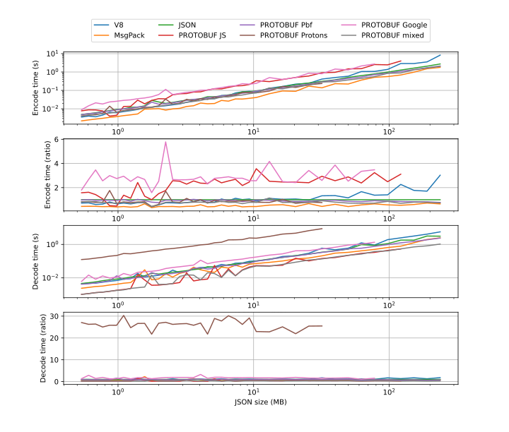
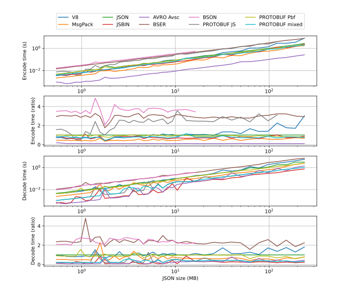

# JavaScript binary serialization comparison (2020-07-26)

This is a comparison and benchmark of various serialisation formats used in JavaScript as of 2020-07-26.

I was myself trying to decide what binary serialization format I should use with regard to performance, compression size and ease of use in my personal projects, and before I knew it I had spent the last few days doing a rather extensive comparison.

By sharing my findings I hope it can be of help (and save time) to someone in a similar situation.

## Abstract

6 different JavaScript serialization libraries and versions are compared:

 * `protobufjs` "6.10.1"
 * `bson` "4.0.4"
 * `google-protobuf` "4.0.0-rc.1"
 * `protons` "1.2.1"
 * `avro-js` "1.10.0"
 * `js-binary` "1.2.0"

During encoding `avro-js` perfomed the fastest at 10 times faster than native JSON at most payload sizes, followed by `js-binary` and `protons` at 2 times faster. `protobufjs` and `bson` perfomed the slowest at about 3 times slower than native JSON.

During decoding, `avro-js`, `protobufjs`, `js-binary` all performed equally well at about 5 times faster than native JSON at most payload sizes. `protons` performed the slowest at 20-30 times slower, followed by `bson` at 1.5 times slower

`avro-js`, `js-binary` gave the best compression ratio of the encoded data at 0.32 compared to JSON, followed by `protobufjs`, `google-protobuf` and `protons` with a ratio of 0.42.

`avro-js`, `js-binary` was able to handle the largest file sizes at both encoding and decoding, with an estimate of 372 MB (measured as JSON) given the default Node.js-heap size. In general the maximum file size coincided with the measured encoding/decoding-speed of each implementation.

`bson`, `js-binary` all convert cleanly back to JavaScript without any detected renmnats from the encoding process. `avro-js`, `js-binary` contained minor remnants. `google-protobuf`, `protons` had additional remnants or ramifications.

## Introduction

Data serialization is ubiquitous in most areas such as sending and receiving data over the network, or storing/reading data from the file system. While JSON is a common modus operandi (especially in JavaScript), using a binary serialization format provide advantages in compression size and sometimes also in performance.

Two common formats are Protocol Buffers and Apache Avro. Avro is inherently a bit more compact than Protobuf, whereas Protobuf uses the additional data as field tags that could make it slightly more forgiving when changing the schema. For those interested an excellent in depth explanation has already been written by Martin Kleppmann: https://martin.kleppmann.com/2012/12/05/schema-evolution-in-avro-protocol-buffers-thrift.html

In addition to this a number of more recent JavaScript oriented libraries will be included in the comparison.

This article will mostly focus on the performance aspect and provide a brief overview of each implementation, but as always, there will be pros and cons of each implementation that could be overlooked depending on your usecase.

## Setup

To run the benchmark yourself, follow these steps.

* Install Node.js ( `12.18.3 LTS` is recommended). 
* Install dependencies:

```shell script
npm install
``` 
* Use default configuration or modify `src/config.ts` as you see fit.
* Select what libraries to test by changing `run-tests.sh` or use default that tests all libraries.
* Run `run-tests.sh` (if you are on Windows use Git BASH or similar):  

```shell script
cd src
. run-tests.sh
```

* Create graphs (requires Python with matplotlib installed) by running:

```shell script
python plot.py
``` 
 
What measurements to plot can further be configured inside the script. Graph images are written to `img/`

Measurements are accumulated into `src/tmp/plot.json` each benchmark iteration. If needed, simply delete the file to reset the graph.

## Disclaimer

This article only focus on measurements using JavaScript. Many of the measured formats have additional implementations in other programming languages that could have different performance characteristics than measured here.

Although outside the scope of this article, compression size (and there by network transfer speed) can be further improved at the cost of encoding/decoding performance by combining the  output with a compressor/decompressor library such `google/snappy` or `zlib`.

This is the first time I use many of the listed libraries and as such there might still be additional optimizations that I am unaware of. Still, I believe my implementation is true to what the majority of users will end up with.

Feel free to inspect my implementations in `src/benchmarks.ts`, and let me know if you find any glaring mistakes (or better yet by submitting a pull request).


## Libraries

The following libraries and versions are tested (sorted by weekly downloads):

 * `protobufjs` "6.10.1" - 3,449k downloads
 * `bson` "4.0.4" - 1,826k downloads
 * `google-protobuf` "4.0.0-rc.1" - 348k downloads
 * `protons` "1.2.1" - 30k downloads
 * `avro-js` "1.10.0" - 1.2k downloads
 * `js-binary` "1.2.0" - 0.3k downloads

They are categorized as:

* Protocol Buffer ( `protobufjs` , `google-protobuf` , `protons` ): `google-protobuf` is Googles official release, but `protobufjs` is by far the most popular, possible due to it being easier to use. To further compare against `protobufjs` a third library called `protons` is included.  
* BSON ( `bson` ): BSON stands for Binary JSON and is popularized by its use in MongoDB. 
* Avro ( `avro-js` ): Although relatively unused `avro-js` is the official JavaScript release by Apache Foundation.
* JS-Binary ( `js-binary` ): The most obscure (judging by weekly downloads). Still `js-binary` seemed like a good contender due to it being easy to use (having a very compact and flexible schema-format) and being optimized for JavaScript. The main drawback being that it will be difficult to use in other programming languages should the need arise.

## Benchmark

Each format will be compared against JavaScripts built in JSON library as a baseline, with regard to compression size and encoding/decoding time. 

The data used in the benchmark is a growing array of tuples that is grown in increments of 1/8 below 10 MB, at each iteration and to speed things up 1/4 above 10 MB. In a real scenario it could be though of as a list of vectors in a 2D or 3D space, such as a 3D-model or similarly data intensive object. 

To further complicate things the first element of the tuple is an integer. This will give a slight edge to some serialization-formats as an integer can be represented more compact in binary rather than floating-point number. To all formats that support it the integer is encoded as a 32-bit signed integer and decimal numbers are encoded as 64-bit floating-point numbers.

The data is as follows:

```
[
  [1, 4.0040000000000004, 1.0009999999999994], 
  [2, 4.371033333333333, 0.36703333333333266], 
  [3, 5.171833333333334, 0.4337666666666671], 
  [4, 6.473133333333333, 0.36703333333333354], 
  ...
]
``` 

The first challenge that arose is that not all serialization formats supports root level arrays, and almost no one seems to support tuples, and as such the arrays first need to be mapped to structs as follows:

```
{
  "items": [
    {"x": 1, "y": 4.0040000000000004, "z": 1.0009999999999994},
    {"x": 2, "y": 4.371033333333333, "z": 0.36703333333333266},
    {"x": 3, "y": 5.171833333333334, "z": 0.4337666666666671},
    {"x": 4, "y": 6.473133333333333, "z": 0.36703333333333354},
    ...
  ]
}
``` 

This wrapped struct array is the final payload that is used in the benchmark unless specified otherwise.

This further gives an advantage to some formats over JSON as duplicate information such as field names can be encoded more efficiently in a schema.

### Precautions

Each appended element in the growing array is modified slightly so that all elements are unique. This is to prevent unpredictable object reuse that could impact measurements.

It was also discovered that some libraries can considerable impact the performance of other libraries when measured in the same running process. To prevent this (and to get reproducable results) all measurements in the results section has been measured with each implementation running in an isolated Node.js process.

### Unmapped data

It should be noted that the time to convert the unmapped data to the mapped structs is excluded from all measurements in the benchmark. Although unmeasured in this article, mapping the data would probably neglect many performance benefit of the selected format and as such, if your application internally uses a similar data representation to the unmapped data you probably want to pick a serialization format that supports its unmapped form.

However, the unmapped formated is more compact (at the cost of readability) and contains less redundant information that could improve serialization performance. To those interested there exists an extra result section with results marked as `(unmapped)` that uses the original unmapped array of arrays data to compare against the performance of the mapped array.

### Hardware

The benchmark is done in Node.js v12.16.3 on 64-bit Windows 10, with an Intel i7-4790K 4.00GHz CPU and 16 GB RAM.

## Result (Protocol Buffers)

Because of its popularity, Protocol Buffer was tested more rigorously than the other formats, and is thus given this dedicated section.

An additional format `Protobuf (mixed)` is added to the comparison that uses `protons` during encoding and `protobuf-js` during decoding, which is explained further down. 
 
All protobuf-implementations in the test uses the following proto-file as schema.

```
syntax = "proto3"; 

message Item {
  int32 x  = 1; 
  double y  = 2; 
  double z  = 3; 
}

message Items {
  repeated Item items = 1; 
}
``` 

### Performance graph



> This graph shows the encode/decode time of each implementation in seconds as well as ratio (compared to JSON) given the payload size in MB (measured as JSON). Please note that a logaritmic scale is used on the `Encode/Decode time (s)` and `JSON size (MB)` axis.

During encoding `protons` and `Protobuf (mixed)` perfomed the fastest at 2 times faster than native JSON at most payload sizes. `protobufjs` and `google-protobuf` perfomed the slowest at about 2-3 times slower.

During decoding, `protobufjs`, `Protobuf (mixed)` performed the fastest at about 5 times faster than native JSON at most payload sizes (although native JSON catches up again at payloads above 200 MB). `protons` perfomed by far the slowest at 20-30 times slower.

### Payload results

| | JSON |JS|Google|Protons|mixed|
|---|---|---|---|---|---
|Size ratio|1.00|0.41|0.41|0.41|0.41|
|Payload limit|298 MB|153 MB|98 MB| 40 MB| 372 MB

> This table shows the encoded size ratio (compared to JSON) as well as the estimated maximum safe payload limit (measured as JSON) each implementation was able to process.

When exceeding the payload limit, given the default JavaScript heap size, a heap allocation error occurred in most cases.

All implementations stayed consistent to the protobuf format and resulted in an identical compression ratio of 0.41 compared to the corresponding file size of JSON at all measured payload sizes.


### Data pollution during decoding

| | JSON |JS|Google|Protons|mixed
|---|---|---|---|---|---
|Prototype pollution      | |x| |x|x
|Getters/Setters| | | |x| 
|Requires unwrapping| | |x| | 
|Unexpected field renames| | |x| | 

> This table shows an overview of negative effects during decoding.


Most of the measured implementations add additional metadata to the prototype of the decoded data.

`google-protobuf` is wrapped in a builder pattern and need to be converted before it can be used, and also introduce unexpected field renames. It is however free from metadata after the final conversion.

`protons` is still usable but wraps all fields into getters/setters that could affect performance. 

`protobuf-js` (which also affects `Protobuf (mixed)`) contains some additional serialization remnants  hidden in the prototype, but should be mostly usable as a plain data object.

It is as of now unkown if any of the raw decoded formats incur an additional overhead to plain objects as this is outside the current scope of this article, but it is something to keep in mind.

### Remarks

#### Protobuf (JS)

`protobuf-js` is slow at encoding but fast at decoding.

During encoding it provided mixed result. At sizes below 1 MB it mostly performs better than the native JSON implementation, but at any larger sizes it performs 2 to 3 times worse.

It was the only implementation that reached its max payload limit of 153 MB during encoding, all other formats reached their limit at decoding. It was discoverd however that it is able to decode payloads (created by other implementations) of greater sizes, up to 372 MB.


#### Protobuf (Protons)

`protons` is fast at encoding but very slow at decoding.

The decoded object has all fields wrapped into getters, which might be partially responsible for the poor decoding performance, and while serviceable, could cause some issues depending on how the decoded data is used. The easiest way to remove all getters/setters is to perform a JSON serialization/deserialization which will further increase decoding time.

It was only able to decode payloads of 47 MB in size, but opposite to `protobuf-js` it is able to encode payloads of much greater size.


#### Protobuf (Google)

`google-protobuf` is slow at encoding, performs average during decoding but might require additional decoding that would further decrese performance, requires extra setup and can cause unexpected renaming of variables.

It does not seem to have an option for deserializing directly form JSON. Instead the following `Items` and `Item` classes are generated by the protocol buffer compiler that generates a Java-esque builder pattern that the date needs to be mapped into, as outlined here:

```
...
const ItemsWrap = Schema.Items;
const ItemWrap = Schema.Item;
const itemsWrap = new ItemsWrap(); 
const itemWraps = data.items.map(item => {
  const itemWrap = new ItemWrap(); 
  itemWrap.setX(item.x); 
  itemWrap.setY(item.y); 
  itemWrap.setZ(item.z); 
  return itemWrap; 
}); 
itemsWrap.setItemsList(itemWraps); 
return itemsWrap.serializeBinary(); 
```

This also unexpecedly renames our array from "items" into "itemsList" which can catch some people of guard and affect the receiving code, as this is not something that is present in other tested Protocol Buffers.

It performs the worst of the implementations during decoding at 2.5 to 3 times slower than native JSON, possible due to the builder overhead.

Deserialization is also misleading. Though it seems to peforms only slightly worse than native JSON, the data is still wrapped in the builder object which should be unusable for most purposes, and an additional call to ".toObject()" is required to fully convert it back to JSON, which would further decrease the performance and still includes the unexpected name change.

#### Protobuf (mixed)

`Protobuf (mixed)` is fast at both encoding and decoding, and is good at handling large filesizes.

This implementation is simply a mix of `protobuf-js` and `protons`, where `protons` is used for encoding and `protobuf-js` for decoding. This results in the best overall performance of all implemenation and to handle larger payloads than both formats are able to individually. While this might too impromptu for most users, it gives us an estimate of how well either of these implementations could perform with some improvements.

### Further remarks

Due to poor results, `protons` and `google-js` will be excluded in further comparisons.

## Result (final)

This is the final comparison of the various formats.

### Performance graph



> This graph shows the encode/decode time of each implementation in seconds as well as ratio (compared to JSON) given the payload size in MB (measured as JSON). Please note that a logaritmic scale is used on the `Encode/Decode time (s)` and `JSON size (MB)` axis.

During encoding `avro-js` perfomed the fastest of all implementations (with good margin) at 10 times faster than native JSON at most payload sizes, followed by `js-binary` and `Protobuf (Mixed)` at 2 times faster. Although native JSON once again catches up at payloads above 200 MB (using the default Node.js heap size).

During decoding, `avro-js`, `protobufjs`, `js-binary`, `Protobuf (Mixed)` all performed equally well at about 5 times faster than native JSON at most payload sizes. `bson` performed the slowest at 1.5 times slower.

### Payload results

| |JSON|BSON|Protobuf (JS)|Protobuf (mixed)|AVRO|JSBIN
|---|---|---|---|---|---|---
|Size ratio|1.00|0.79|0.42|0.42|0.32|0.32
|Payload limit|298 MB|21 MB| 153 MB| 372 MB|372 MB| 372 MB

> This table shows the encoded size ratio (compared to JSON) as well as the estimated maximum safe payload limit (measured as JSON) each implementation was able to process.

`avro-js`, `js-binary` gave the best compression ratio of the encoded data at 0.32 compared to JSON, followed by `protobufjs`, `google-protobuf`, `protons` with a ratio of 0.42.

`avro-js`, `js-binary` was able to handle the largest file sizes at both encoding and decoding, with an estimate of 372 MB (measured as JSON) given the default Node.js-heap size. In general the maximum file size coincided with the measured encoding/decoding-speed of each implementation.

### Data pollution during decoding

| |BSON|JSBIN|AVRO|Protobuf (JS)|Protobuf (mixed)
|---|---|---|---|---|---
|Prototype pollution | | |x|x|x|

> This table shows an overview of negative effects during decoding.

`bson`, `js-binary` all convert cleanly to JavaScript without any detected renmnats from the encoding process.

`avro-js`, `protobuf-js` (which also affects `Protobuf (mixed)`) should be mostly usable as a plain data object, but contains some additional serialization remnants hidden in the prototype. 

### Remarks

#### AVRO

`avro-js` is the fastest measured implementation at encoding, fast at decoding, has a very good size ratio and is good at handling large payloads.

#### BSON

`bson` is slow at both encoding and decoding and bad at handling large paylods, but does not require a schema and is decoded cleanly without added metadata.


#### JSBIN

`js-binary` is fast at both encoding and decoding, has a very good size ratio is good at handling large payloads and is decoded cleanly without added metadata.


## Result (extra)

As mentioned in the Benchmark chapter not all formats where able to handle the unmapped data. 


However, in 


 not investigated by this article.


 not investigated in this article, . However, the unmapped data includes less repeated information which could improve performance.


 it (although unmeasured here) would incur performance overhead of mapping the data.

The mapping process of the data is excluded from the benchmark, but

It is worth to keep in mind that in addition to the 

### Unmapped data result graph

| |JSON|JSON (unmapped)|JSBIN|JSBIN (unmapped)|BSON|BSON (unmapped)
|---|---|---|---|---|---|---
|Size ratio|1.00|0.77|0.32|0.48|0.79|0.79

> This graph shows the relative performance of


### Unmapped data result graph


> This graph shows the relative performance of 

### Discussion

`js-binary` did not have any measurable performance improvement by switching to unmapped data. It did however increase the size ratio of the encoded data . This is due to the first element in each tuple being encoded as a double instead of a


| |JSON|JSBIN|JSBIN (optional)|JSBIN JSON (unmapped)
|---|---|---|---|---|---|---
|Size ratio|1.00|0.032|0.38|0.77


